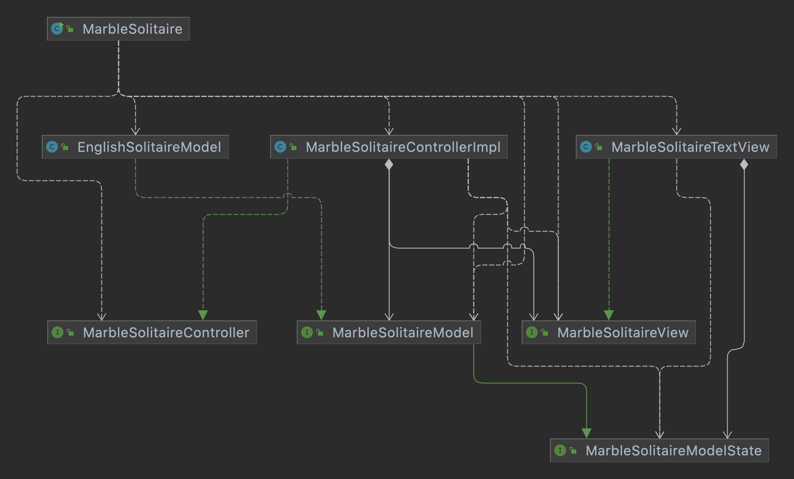

How to use:

Right now, this game of marble solitaire allows the user to 
customize the armthickness of their board,
or just play a regular game of marble solitare.

to play, run the main class, add a
$Prompt$ argument to control the arm thickness.

